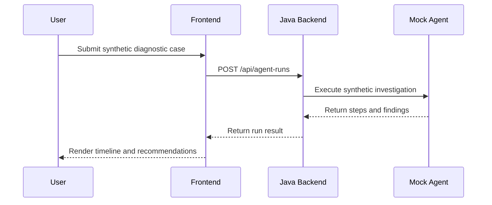

# Architecture

## Overview

Network Agent Workbench will use a contract-first monorepo structure:

- `frontend`: browser-based workbench for submitting synthetic cases and reviewing results.
- `backend`: Java service that owns API endpoints, validation, orchestration, and run history.
- `mock-agent`: deterministic synthetic agent implementation for local development.
- `contracts`: request and response examples shared across components.
- `deploy`: local development deployment helpers.

## Initial Flow

## Data Boundary

Only synthetic diagnostic cases belong in this repository. Real production logs, internal credentials, and private company data are outside the project boundary.
