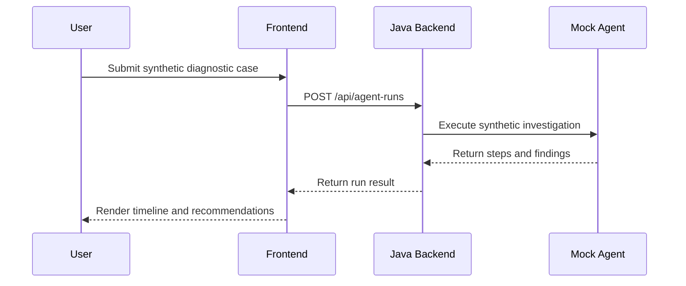
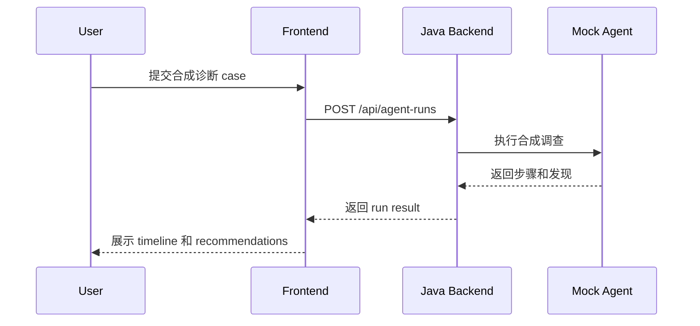

# Architecture

Language: [English](#english) | [中文](#中文)

## English

### Overview

Network Agent Workbench will use a contract-first monorepo structure:

- `frontend`: browser-based workbench for submitting synthetic cases and reviewing results.
- `backend`: Java service that owns API endpoints, validation, orchestration, and run history.
- `mock-agent`: deterministic synthetic agent implementation for local development.
- `contracts`: request and response examples shared across components.
- `deploy`: local development deployment helpers.

### Initial Flow

### Data Boundary

Only synthetic diagnostic cases belong in this repository. Real production logs, internal credentials, and private company data are outside the project boundary.

## 中文

### 概览

Network Agent Workbench 将采用 contract-first 的 monorepo 结构：

- `frontend`：基于浏览器的 workbench，用于提交合成 case 并查看结果。
- `backend`：Java service，负责 API endpoints、validation、orchestration 和 run history。
- `mock-agent`：用于本地开发的确定性合成 agent 实现。
- `contracts`：跨组件共享的 request 和 response examples。
- `deploy`：本地开发部署辅助文件。

### 初始流程

### 数据边界

本仓库只应包含合成诊断 case。真实生产日志、内部凭据和公司私有数据都在项目边界之外。
